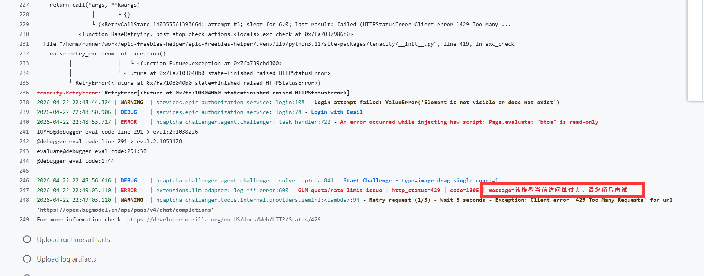

# GitHub Actions 使用说明

当前仓库已经内置 [`.github/workflows/epic-gamer.yml`](/Users/ronchy2000/Documents/Developer/Workshop/epic-awesome-gamer/.github/workflows/epic-gamer.yml)，推荐直接使用它来定时执行。

## 工作流做了什么

这个工作流会在 GitHub Hosted Runner 上完成以下步骤：

1. 检出仓库代码。
2. 安装 `uv` 和 Python 3.12。
3. 安装系统依赖。
4. 执行 `uv sync` 安装 Python 依赖。
5. 下载 Camoufox 浏览器资源。
6. 在 `xvfb` 环境中运行 `uv run app/deploy.py`。

它默认由 GitHub 的 `schedule` 和 `workflow_dispatch` 触发，仓库内的 APScheduler 会被关闭，避免重复调度。

## Secrets 配置

必须配置：

| Secret | 说明 |
| --- | --- |
| `EPIC_EMAIL` | Epic 邮箱，需关闭 2FA |
| `EPIC_PASSWORD` | Epic 密码，需关闭 2FA |

如果你使用 Gemini/AiHubMix：

| Secret | 说明 |
| --- | --- |
| `LLM_PROVIDER` | 建议设为 `gemini` |
| `GEMINI_API_KEY` | Gemini 或 AiHubMix Key |
| `GEMINI_BASE_URL` | 可选，默认 `https://aihubmix.com` |
| `GEMINI_MODEL` | 可选，默认 `gemini-2.5-pro` |

如果你使用 GLM：

| Secret | 说明 |
| --- | --- |
| `LLM_PROVIDER` | 建议设为 `glm` |
| `GLM_API_KEY` | 智谱 API Key |
| `GLM_BASE_URL` | 可选，默认 `https://open.bigmodel.cn/api/paas/v4` |
| `GLM_MODEL` | 可选，推荐 `glm-4.6v` |

程序会优先读取这些模型覆盖项，如果未设置，则自动回落到 `GLM_MODEL` 或 `GEMINI_MODEL`：

- `CHALLENGE_CLASSIFIER_MODEL`
- `IMAGE_CLASSIFIER_MODEL`
- `SPATIAL_POINT_REASONER_MODEL`
- `SPATIAL_PATH_REASONER_MODEL`

这些变量也可以直接作为 GitHub Secrets 配置，工作流已经会自动透传。

## 为什么 GLM 不能直接替换 Gemini 地址

因为仓库底层依赖 `hcaptcha-challenger`，而它内部用的是 `google-genai` 的多模态上传和 `generate_content` 接口。

这次仓库已经新增适配层：

- Gemini/AiHubMix 继续使用原有兼容补丁。
- GLM 会自动转成智谱 OpenAI-compatible `chat/completions` 请求。

这也是为什么 GLM 这里推荐 `glm-4.6v` 这类视觉模型，而不是纯文本的编码模型。
如果你用 `glm-4.6v-flash` 遇到“该模型当前访问量过大，请您稍后重试”，直接改成 `GLM_MODEL=glm-4.6v` 通常更稳。

## 建议的首次启动流程

1. Fork 仓库。
2. 仓库改为私有。
3. 配置 Secrets。
4. 到 `Actions` 页面手动运行一次。
5. 查看日志确认是否完成登录和领取。

## Fork 后如何和主仓库同步

为了避免你 Fork 的仓库代码落后，建议定期和上游主仓库（`Ronchy2000/epic-freebies-helper`）同步，尤其在遇到异常报错时先同步再重试。网页端直接在 Fork 仓库默认分支点击 `Sync fork` -> `Update branch` 即可；如果提示冲突，就点 `Compare changes` 按引导发起并合并 Pull Request，之后再回到 Actions 重新运行一次工作流。

## 常见问题

### 1. Action 运行了但登录卡住

GitHub 的共享出口 IP 可能被 Epic 风控。通常换个时间重新执行就能恢复。

### 2. GLM 报 429/400/401

优先检查：

- 如果日志里出现 `message=该模型当前访问量过大，请您稍后再试` 或 HTTP `429`，优先把 `GLM_MODEL` 改为 `glm-4.6v`（不要用 `glm-4.6v-flash`）。
- `LLM_PROVIDER=glm`
- `GLM_BASE_URL=https://open.bigmodel.cn/api/paas/v4`
- `GLM_MODEL=glm-4.6v`
- API Key 是否仍然有效

示例日志（429 限流）：

### 3. 为什么每天跑一次而不是每周跑一次

GitHub Actions 每天跑一次更稳妥。脚本内部会判断是否有新的周免内容，没有的话会直接结束。
